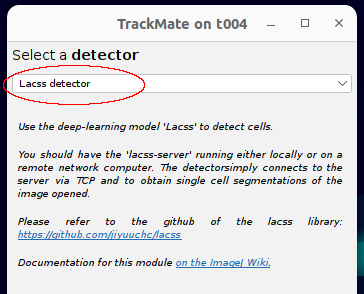
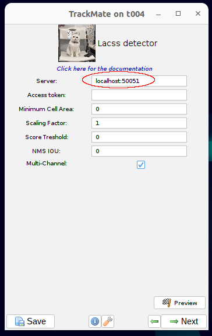

# TrackMate-Lacss

A plugin of a plugin. 

This software adds a new cell detector to [TrackMate](https://imagej.net/plugins/trackmate/index), an interactive cell/object tracker of [FIJI/ImageJ](https://imagej.net/software/fiji/). The detector uses a deep-learning model [Lacss](https://github.com/jiyuuchc/lacss) to find and segment cells.

It also add a ```Plugins/Segmntation/Lacss``` menu item, so that you can also perform simple segmentation on non-time-lapse data.

## How does it work

This simple Java plugin communicates with the open [GRPC](https://grpc.io/) server (lacss.biopb.org). The pixel data are sent via internet. The computation is done on the server side. You can obtained results quickly even if you are on a low-end computer without GPU.

## Installation

Install Trackmate-Lacss plugin via Fiji's the built-in updater, i.e. ```Help/Update/Manage update sites```.

|  |  |


## Usage
Start TrackMate in Fiji (`Plugins/Tracking/TrackMate`). At the detector selection page, select "Lacss detector" from the dropdown menu.




## (Optional) Setup your own server

By default, trackmate-lacss will try to connect to the public server that we setup at lacss.biopb.org. However, you can also easily setup your own server, which allows for faster reponse and better data security.

#### Requirement: A linux system with an NVidia GPU.

**Step 1:** Install Lacss
```
pip install lacss[cuda12]
```
You probabaly want to create a virtual environment for this.

**Step 2:** Download a model file. See [here](https://github.com/jiyuuchc/lacss?tab=readme-ov-file#models-checkpoints).

**Step 3:** Start the Lacss server
```
python -m lacss.deploy.remote_server --modelpath=<model_file> --no-token
```
Wait until the server fully starts. You should see these outputs:
```
....
INFO:root:lacss_server: default backend is gpu
INFO:root:lacss_server: listening on port 50051
```

**Step 4:** Run Trackmate as usual. At tha Lacss configuration page, provide the correct server address.




